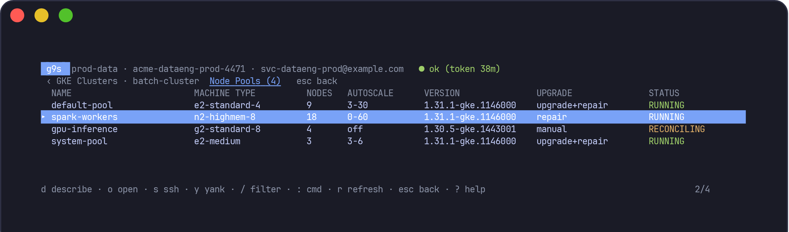

# g9s

A k9s-style terminal console for Google Cloud. Switch between projects and
accounts, inspect resources, and navigate related resources without changing
your global gcloud configuration.

> **Current maturity:** read-only MVP. The source contains 43 top-level
> resource kinds and 21 drill-down listings. SSH to a running VM is the only
> interactive resource operation; mutating API actions are not implemented.

## At a glance

```text
Projects  →  Project dashboard  →  Resource table  →  Child drill-down
accounts      all kinds             one kind          node pools, tables,
and login     and status            or all kinds      keys, health, etc.
```

- **Projects** shows every configured project and its live credential state.
- **Dashboard** loads all implemented kinds and summarizes counts, states and
  partial failures.
- **Resource table** provides filtering, YAML details, Console links, copy and
  SSH where applicable.
- **Drill-down** opens a resource's children in place. For example, a GKE
  cluster opens its node pools and a Cloud SQL instance opens databases and
  users.




See [docs/README.md](docs/README.md) for all generated screenshots.

## Complete resource map

This is the source of truth for resource coverage.

- ✅ **Implemented** — available now and complete for its documented scope.
- 🟡 **Implemented, bounded** — available now, with a configurable default row
  or request limit. The TUI warns when the limit is reached.
- ✅ **Implemented, paged** — available now, loading one bounded page at a
  time with an explicit continuation action.
- 🔒 **Implemented, metadata only** — available now, with sensitive values
  deliberately excluded.
- 🔜 **Not implemented, next** — the next planned resource work.
- ⬜ **Not implemented, candidate** — planned for consideration, with no
  delivery commitment.
- 🚫 **Not planned** — intentionally outside the product boundary.

**Surface** shows how the listing is reached: a top-level dashboard kind or a
drill-down opened from a parent row.

| Area | Service and resource hierarchy | Surface | Status | Coverage note |
|---|---|---|---|---|
| Compute and serverless | **Compute Engine** → VM instances | Top-level | ✅ Implemented | One aggregated call covers every zone |
|  | ↳ Attached disks | VM drill-down | ✅ Implemented | Already present on the VM response; highlights auto-delete |
|  | **Compute Engine** → Persistent disks | Top-level | ✅ Implemented | Includes unattached state and age |
|  | **Compute Engine** → Disk snapshots | Top-level | ✅ Implemented | Global plus regional (GCP Preview), in one project-wide listing; snapshots can outlive their source disks |
|  | **Compute Engine** → Managed instance groups | Top-level | ✅ Implemented | Zonal and regional groups in one aggregated listing |
|  | ↳ Managed VM instances | Group drill-down | ✅ Implemented | Instance state, current action, intended template and version |
|  | **Compute Engine** → Instance templates | Top-level | ✅ Implemented | Global and regional templates; includes machine shape and accelerators |
|  | **Compute Engine** → Capacity reservations | Top-level | ✅ Implemented | Includes GPU-backed reservations and unused/partial utilization findings |
|  | **Cloud TPU** → Queued resources and reservations | — | ⬜ Candidate | Separate service and API; not part of Compute Engine reservation coverage |
|  | **Batch** → Jobs | — | ⬜ Candidate | Not implemented |
|  | **Cloud Functions** → Functions | Top-level | ✅ Implemented | Both generations; aggregated across locations |
|  | **Cloud Run** → Services | Top-level | ✅ Implemented | Listed across configured regions |
|  | ↳ Revisions | Service drill-down | ✅ Implemented | Includes traffic split from the parent service |
|  | **Cloud Run** → Jobs | Top-level | ✅ Implemented | Includes the last execution result |
|  | ↳ Executions | Job drill-down | ✅ Implemented | Full execution history for the selected job |
| Containers | **Google Kubernetes Engine** → Clusters | Top-level | ✅ Implemented | Aggregated across zonal and regional clusters |
|  | ↳ Node pools | Cluster drill-down | ✅ Implemented | Already present on the cluster response |
| Storage | **Cloud Storage** → Buckets | Top-level | ✅ Implemented | Bucket inventory; objects are fetched only when one bucket is opened |
|  | ↳ Objects and folders | Bucket drill-down | ✅ Implemented, paged | 500 rows per page by default; path navigation, prefix jumps and server-side glob search |
|  | ↳ Lifecycle rules | Bucket drill-down | ✅ Implemented | Delete and storage-class transition rules |
| Data and analytics | **BigQuery** → Datasets | Top-level | ✅ Implemented | Name, location, type and labels |
|  | ↳ Tables | Dataset drill-down | 🟡 Implemented, bounded | 1,000 rows per dataset by default |
|  | **BigQuery** → Jobs | Top-level | 🟡 Implemented, bounded | 500 rows by default inside the configured time window |
|  | **BigQuery** → Reservations | Top-level | ✅ Implemented | Swept across the configured regions plus `US` and `EU`, where most reservations actually live. Flags baseline slots billed continuously and not lent to other reservations |
|  | **Dataproc** → Clusters | Top-level | ✅ Implemented | Listed per configured region; `global` is always included |
|  | ↳ Jobs on this cluster | Cluster drill-down | 🟡 Implemented, bounded | 200 rows by default |
|  | **Dataproc** → Jobs | Top-level | 🟡 Implemented, bounded | 200 rows per configured region by default |
|  | **Dataflow** → Jobs | Top-level | 🟡 Implemented, bounded | 500 rows by default; API aggregates locations |
|  | **Cloud Composer** → Environments | Top-level | ✅ Implemented | Listed per configured location |
|  | **Bigtable** → Instances | Top-level | ✅ Implemented | One global call. An instance holds no data itself; DEVELOPMENT type is flagged because it means one node, no SLA and no replication |
|  | ↳ Clusters | Instance drill-down | ✅ Implemented | Nodes, zone, storage type and autoscaling — the billed capacity, which the instance row cannot show |
|  | **Spanner** → Instances | Top-level | ✅ Implemented | One global call. Capacity normalised to processing units with the node equivalent, so an instance sized in nodes and one sized in PU are comparable |
|  | ↳ Databases | Instance drill-down | ✅ Implemented | Leads with drop protection, which is off by default and is the only guard against a one-command deletion |
|  | **Memorystore** → Redis instances | Top-level | ✅ Implemented | One call; the API aggregates every region. Flags basic tier (single node, no failover) and AUTH left off |
|  | **Memorystore** → Memcached instances | Top-level | ✅ Implemented | One call; the API aggregates every region. Flags nodes that are not serving while the instance itself still reports READY |
|  | **Firestore** → Databases | Top-level | ✅ Implemented | One global call. Delete protection and point-in-time recovery are both off by default and report nothing when off |
|  | **Datastream** → Streams | Top-level | ✅ Implemented | One call; the API aggregates every region. Errors outrank the state, because a stream can be RUNNING and failing every row it reads |
|  | **Data Fusion** → Instances | Top-level | ✅ Implemented | One call; the API aggregates every region. Edition leads the row — an instance bills per hour for as long as it exists, run or not |
|  | **Artifact Registry** → Repositories | Top-level | ✅ Implemented | Listed per configured region. Size and cleanup policy on the row, because a registry nothing prunes grows until someone reads the bill |
| Databases | **Cloud SQL** → Instances | Top-level | ✅ Implemented | Includes version, tier, HA and unreachable-region warnings |
|  | ↳ Databases | Instance drill-down | ✅ Implemented | One of two sibling listings |
|  | ↳ Users | Instance drill-down | ✅ Implemented | Includes disabled state; `tab` switches siblings |
| Messaging | **Pub/Sub** → Topics | Top-level | ✅ Implemented | Includes ingestion-source state |
|  | ↳ Subscriptions on this topic | Topic drill-down | ✅ Implemented | Warns when a topic has no subscriptions |
|  | **Pub/Sub** → Subscriptions | Top-level | ✅ Implemented | Includes backlog from one Monitoring query |
| Networking | **VPC** → Networks | Top-level | ✅ Implemented | Subnet mode, count and routing mode |
|  | ↳ Subnets | Network drill-down | ✅ Implemented | Aggregated across regions; includes secondary ranges |
|  | **VPC** → Firewall rules | Top-level | ✅ Implemented | Sorted by evaluation priority; disabled rules are flagged |
|  | **VPC** → Routes | Top-level | ✅ Implemented | Network, destination, priority and resolved next-hop type |
|  | **Cloud Router** → Routers | Top-level | ✅ Implemented | Region, network, ASN, peers, interfaces and NAT count |
|  | ↳ Cloud NAT gateways | Router drill-down | ✅ Implemented | Inline router configuration; IP allocation, sources, ports and logging |
|  | **Cloud Load Balancing** → Forwarding rules | Top-level | ✅ Implemented | Covers global and regional forwarding rules |
|  | ↳ Backend health | Rule drill-down | 🟡 Implemented, bounded | 40 backend groups by default; bounds API requests |
|  | **Cloud DNS** → Managed zones | Top-level | ✅ Implemented | Global listing |
|  | ↳ Record sets | Zone drill-down | 🟡 Implemented, bounded | 1,000 rows per zone by default |
|  | **Cloud VPN** → VPN tunnels | Top-level | ✅ Implemented | Aggregated across regions with live tunnel status |
|  | **Cloud Interconnect** → VLAN attachments | Top-level | ✅ Implemented | Aggregated across regions |
|  | **Private Service Connect** → Service attachments | Top-level | ✅ Implemented | Producer side; consumer endpoints are forwarding rules |
|  | **Compute networking** → Reserved static IPs | Top-level | ✅ Implemented | Global and regional IPv4/IPv6 addresses, users and reservation state |
| Security and identity | **Secret Manager** → Secrets | Top-level | 🔒 Metadata only | Replication, rotation and expiry; never secret values |
|  | ↳ Versions | Secret drill-down | 🔒 Metadata only | Names, states and timestamps; never secret values |
|  | **IAM** → Service accounts | Top-level | 🟡 Implemented, bounded | Key age lookup for 200 accounts by default |
|  | ↳ Keys | Account drill-down | 🔒 Metadata only | ID, origin, algorithm, age and expiry; never private key material |
|  | ↳ Direct project roles | Account drill-down | ✅ Implemented | One version-3 project policy read, filtered to the account; conditions are shown and inherited folder/organization roles are explicitly outside the listing |
|  | **IAM** → Project policy bindings | — | ⬜ Candidate | Needs a table shaped around role/member pairs |
|  | **Cloud KMS** → Keys | Top-level | 🟡 Implemented, bounded | 100 key rings per location by default; never key material |
|  | **Certificate Manager** → Certificates | — | ⬜ Candidate | Not implemented |
|  | **Binary Authorization** → Policies | — | ⬜ Candidate | Not implemented |
|  | **VPC Service Controls** → Perimeters | — | ⬜ Candidate | Not implemented |
|  | **Organization Policy** → Effective constraints | — | ⬜ Candidate | Not implemented |
| Operations | **Cloud Scheduler** → Jobs | Top-level | ✅ Implemented | Includes paused state and last-attempt result |
|  | **Cloud Monitoring** → Alert policies and firing state | — | ⬜ Candidate | Not implemented |
|  | **Error Reporting** → Error groups | — | ⬜ Candidate | Not implemented |
|  | **Cloud Tasks** → Queues | — | ⬜ Candidate | Not implemented |
|  | **Cloud Build** → Build history | — | ⬜ Candidate | Not implemented |
|  | **Cloud Logging** → Log entries | — | 🚫 Not planned | An unbounded query stream, not a finite resource inventory |
| Cost and capacity | **Cloud Quotas** → Usage and limits | — | ⬜ Candidate | Nested quota metrics need a different presentation |
|  | **Cloud Billing** → Current-month spend | — | ⬜ Candidate | Requires an accessible billing export |

### Platform capabilities

| Capability | Status | Current note |
|---|---|---|
| Project picker and live credential state | ✅ Implemented | Checks every configured project at startup |
| Isolated credentials per project | ✅ Implemented | Does not mutate global gcloud state |
| Per-project dashboard and **All Resources** view | ✅ Implemented | Status rollups plus a merged table |
| Filtering, YAML detail, links, clipboard and SSH | ✅ Implemented | SSH is limited to running VMs |
| Parent/child drill-downs with sibling tabs | ✅ Implemented | 19 child listings |
| Partial-result and row-cap warnings | ✅ Implemented | A bounded or incomplete result cannot look complete |
| Expected account versus actual ADC identity | ✅ Implemented | The actual identity is displayed; a live token for a different configured account is refused |
| Assisted login for proxied corporate browsers | ✅ Implemented | Paste the stuck localhost redirect; g9s delivers it past the proxy |
| Consistent HTTP/gRPC permission errors | ✅ Implemented | REST 403/401 map to the same wording as gRPC; unenabled APIs stay quiet |
| Large OSC 52 clipboard payload handling | 🟡 Needs improvement | Terminal limits can make large YAML copies fail silently |
| Prebuilt release pipeline | ✅ Implemented | Every merge to `main` builds, checks and publishes a release |
| Confirmed VM/Dataproc state actions | 🔜 Next | No mutating API action is implemented today |
| Terraform managed/drifted/unmanaged overlay | 🔜 Next | Read state; do not replace Terraform |
| Cross-project inventory for one kind | ⬜ Candidate | Requires context-aware identity and bounded concurrency |
| Horizontal dev/uat/prod comparison | ⬜ Candidate | Builds on the cross-project inventory model |
| Cloud Asset Inventory fast path | ⬜ Candidate | Optional; many organizations do not enable the API |
| Saved filters and bookmarks | ⬜ Candidate | Not implemented |
| CSV and JSON export | ⬜ Candidate | Not implemented |
| `g9s doctor` preflight checks | ✅ Shipped | Config, gcloud, proxy/loopback, credential permissions, live identity |
| Writing infrastructure definitions | 🚫 Not planned | g9s is not a Terraform replacement |
| Storing passwords or minting credentials itself | 🚫 Not planned | gcloud owns interactive authentication |
| Displaying secret values or private key material | 🚫 Not planned | Metadata only |

See [ROADMAP.md](ROADMAP.md) for design rationale and request costs, and
[ADVICE.md](ADVICE.md) for the cross-project architecture review.

## Requirements and installation

- **gcloud CLI** is required for login and SSH.
- **Go 1.25+** is currently required to install g9s because the first verified
  release binary has not been published.

With Homebrew on macOS:

```sh
brew install go
brew install --cask gcloud-cli
go install github.com/TTMathCS/g9s/cmd/g9s@latest
```

`go install` normally writes to `~/go/bin`. Add that directory to `PATH`
if needed:

```sh
export PATH="$HOME/go/bin:$PATH"
```

To build a clone:

```sh
git clone https://github.com/TTMathCS/g9s.git
cd g9s
go build -o g9s ./cmd/g9s
```

On a restricted network, point `GOPROXY` at your internal module registry.
Cloning the source does not remove the need to fetch the modules in `go.mod`.

## Quick start

```sh
g9s -init
$EDITOR ~/.config/g9s/config.yaml
g9s
```

Start with one project. Select it and press `l`; g9s starts
`gcloud auth application-default login` and opens the sign-in link, staying
interactive so a login that gets stuck can be rescued — see
[Login on a corporate laptop](#login-on-a-corporate-laptop). Press `L`, or set
`defaults.login_no_browser: true`, when this machine has no browser at all.
`g9s doctor` checks the whole setup from the command line.

## Configuration

The default file is `~/.config/g9s/config.yaml`. Override it with
`$G9S_CONFIG` or `g9s -config <path>`.

```yaml
defaults:
  # Regional services only scan locations listed here.
  regions:
    - northamerica-northeast1
    - us-central1

  credential_dir: ~/.local/share/g9s/credentials
  gcloud_path: gcloud
  login_no_browser: false
  list_timeout: 90s
  bigquery_job_window: 24h
  storage_objects_page_size: 500

projects:
  - name: sandbox
    project_id: my-sandbox-project
    description: personal access, read-only

  - name: prod-data
    project_id: my-prod-data-project
    account: svc-prod-support@example.com
    regions:
      - northamerica-northeast1
    composer_locations:
      - us-central1
```

Project settings override defaults. Dataproc and KMS always include `global`.
Unknown YAML keys are errors. An existing ADC file can be selected with
`credentials_file` when no interactive browser flow works. See
[config.example.yaml](config.example.yaml) for the annotated configuration.

### Storage object browsing

Open a bucket and select its **Objects** drill-down. The initial page lists
only the current path's immediate objects and folders; it never recursively
downloads an entire bucket.

| Key or command | Action |
|---|---|
| `enter` on a folder | Open that prefix |
| `q` / `esc` | Clear a search, move to the parent path, then return to buckets |
| `space` | Load the next page when the count has a `+` suffix |
| `:cd logs/2026/` | Jump to a prefix relative to the current path |
| `:cd /logs/` or `:cd gs://bucket/logs/` | Jump from the bucket root |
| `:find **/*.json` | Server-side glob search below the current path |
| `/` | Filter only the rows already loaded in the TUI |

`storage_objects_page_size` defaults to 500 and accepts 1–1,000. It controls
one TUI page, not the total number of rows available: continuation tokens remain
available until the API reports the last page. The client may make another
service request to fill one page when Cloud Storage returns a shorter response.
Current object generations are shown by default; older versions and
soft-deleted objects are not mixed into the ordinary browser.

### Row and request limits

Omitted or `0` uses the default. A positive number sets a custom cap; `-1`
removes it. The footer warns whenever a listing reaches its cap.

| Key | Default | Bounds |
|---|---:|---|
| `bigquery_jobs` | 500 | Rows inside `bigquery_job_window` |
| `dataflow_jobs` | 500 | Rows |
| `dataproc_jobs_per_region` | 200 | Rows per region |
| `cluster_jobs` | 200 | Rows per cluster |
| `bigquery_tables` | 1,000 | Rows per dataset |
| `dns_record_sets` | 1,000 | Rows per zone |
| `backend_groups` | 40 | Requests: one health call per group |
| `service_account_key_lookups` | 200 | Requests: one key-list call per account |
| `kms_key_rings` | 100 | Requests per location |

```yaml
defaults:
  limits:
    bigquery_jobs: 5000
    dns_record_sets: -1
    backend_groups: 10
```

## Keys

| Key | Action |
|---|---|
| `↑`/`k`, `↓`/`j`, `g`/`G` | Move; jump to top or bottom |
| `enter` | Open a dashboard kind or the selected row's drill-down; otherwise describe |
| `d` | Always describe the selected resource as YAML |
| Displayed hotkey | Open that resource kind directly |
| `0` / `a` | Open **All Resources** |
| `tab` / `shift+tab`, `]` / `[` | Cycle kinds or sibling drill-downs |
| `:` | Command mode; for example `:vm`, `:all`, or `:cd` / `:find` in Storage Objects |
| `/` | Filter rows; `esc` clears |
| `space` | Load the next Storage Objects page when available |
| `r` | Refresh the current kind, all dashboard kinds, or selected credential |
| `o` | Open Airflow for Composer; Cloud Console otherwise |
| `y` | Copy the resource name; from detail view, copy YAML |
| `s` | SSH to a selected running VM |
| `l` / `L` | Login: assisted browser flow / no-browser flow for machines without one |
| `q` / `esc` | Back one level |
| `p` | Return to projects |
| `?` | Help |
| `ctrl+c` / `:q` | Quit |

## Authentication and safety

g9s never receives a password. Login is always gcloud's own
`auth application-default login` flow: the browser or identity provider
handles password and MFA, and gcloud writes the credential.

Each project uses its own `CLOUDSDK_CONFIG` directory, so switching projects
does not change `~/.config/gcloud`. Credential expiry is checked with a live
token exchange. Resource discovery uses typed Google clients; gcloud is used
only for login and SSH.

### Login on a corporate laptop

The standard gcloud browser login has a step that corporate proxies break:
after you sign in, the browser fetches `http://localhost:<port>/` to hand the
authorization code back to gcloud. A browser that sends localhost through the
proxy never delivers it — the sign-in *succeeds* and gcloud waits forever.

g9s runs the browser login in **assisted mode** to survive exactly this.
Press `l`; g9s starts gcloud, opens the sign-in link, and stays interactive:

1. If your browser can reach its own localhost, the login completes by itself —
   nothing to do.
2. If the browser instead lands on an error like *"localhost refused to
   connect"*, the login is still alive. **Copy the entire address from that
   stuck tab's address bar** (it looks like
   `http://localhost:8085/?state=…&code=…`) and paste it into g9s. g9s hands
   it to gcloud on your machine directly, bypassing the proxy, and the login
   completes. The code in that address is single-use and useless outside the
   running login.

If the flow cannot run at all (no browser on this machine), press `L` for
gcloud's `--no-browser` flow: gcloud prints a **command** — not a link — to
run on a machine that has a browser and gcloud 372.0.0+, and that command's
output is pasted back. Opening the URL inside it in a browser produces
`Error 400: missing required parameter: redirect_uri`; the command is the
thing to copy.

If neither interactive flow can complete, run
`gcloud auth application-default login` wherever it does work and point the
project at the file it writes with `credentials_file:` in the config.

### `g9s doctor`

`g9s doctor` (or `g9s -doctor`) checks the whole setup outside the TUI and
prints one line per finding, with a remedy for anything broken: the config
file, the gcloud binary and version, whether a proxy would break the browser
login, per-project credential directory permissions, and — unless `-offline`
is set — a live token exchange for every project, verifying each credential
belongs to the account the config expects. It exits non-zero on failures, so
it also works as a scripted onboarding check:

```sh
g9s doctor            # everything, including live credential checks
g9s doctor -offline   # config, gcloud and proxy checks only; nothing leaves the machine
```

All GCP API calls are currently read-only. API-supplied control characters are
removed before rendering, and sensitive fields returned inside otherwise
ordinary resources are redacted before YAML reaches the terminal or clipboard.
See [SECURITY.md](SECURITY.md) for the full threat model.

## Partial, bounded and paged results

When one region fails, g9s keeps successful rows and reports the failed scope:

```text
⚠ 2 warnings: europe-west1: permission denied; us-east4: permission denied
```

When a configurable cap is reached, it is reported the same way:

```text
⚠ 1 warning: only the 500 most recent jobs are shown
```

Storage Objects is paged rather than capped. A count such as `500+` means a
continuation token is available; press `space` to append the next page. It is
not shown as a warning because no scope failed and the next page remains
directly reachable.

Keep configured region lists accurate. A regional resource in a location that
was never requested cannot be discovered.

## Development

Top-level kinds implement `gcp.Lister` and register in `Listers()`.
Resources belonging to one parent row implement `gcp.ChildLister` and
register in `Children()`. The UI discovers both registries automatically.

```sh
gofmt -w .
go vet ./...
go test -race ./...
go build ./...
```

## License

[MIT](LICENSE)
