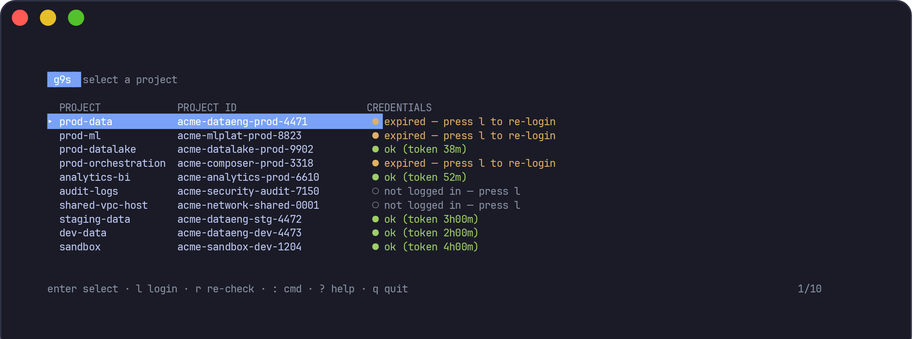
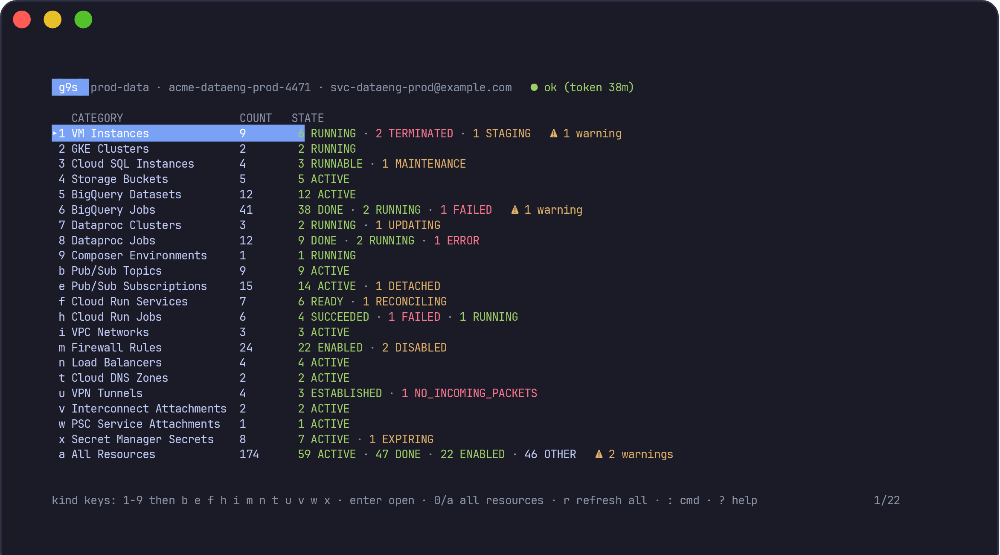
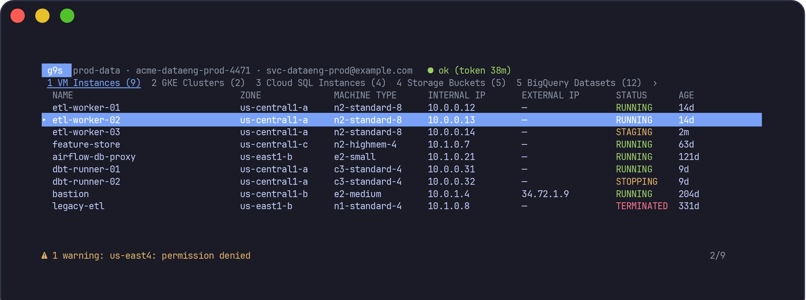

<h1 align="center">g9s</h1>

<p align="center">
  A k9s-style terminal UI for Google Cloud. Pick a project, browse what's running in it,<br>
  act on it — without leaving the terminal or juggling <code>gcloud config set project</code>.
</p>

<p align="center">
  <a href="https://github.com/TTMathCS/g9s/releases/latest"></a>
  &nbsp;
  <a href="https://github.com/TTMathCS/g9s/releases"></a>
</p>

<p align="center">
  <a href="https://github.com/TTMathCS/g9s/releases/latest"></a>
  <a href="https://github.com/TTMathCS/g9s/actions/workflows/ci.yml"></a>
  <a href="https://github.com/TTMathCS/g9s/releases"></a>
  <a href="LICENSE"></a>
</p>

Built for the case where you have several projects, each reached through a different account, and those accounts expire daily.

## ⬇️ Download

**Both buttons above go straight to GitHub's download pages** — the green one to the newest version, the blue one to the full list of every version ever released. Every merge to `main` publishes a new version automatically, so the latest is always current.

No Go toolchain and nothing compiled on your machine. Direct per-platform links, which always resolve to the newest version:

| Platform | Download |
|---|---|
| **macOS** — Apple Silicon (M1–M4) | **[g9s_darwin_arm64.tar.gz](https://github.com/TTMathCS/g9s/releases/latest/download/g9s_darwin_arm64.tar.gz)** |
| **macOS** — Intel | **[g9s_darwin_amd64.tar.gz](https://github.com/TTMathCS/g9s/releases/latest/download/g9s_darwin_amd64.tar.gz)** |
| **Linux** — x86-64 | **[g9s_linux_amd64.tar.gz](https://github.com/TTMathCS/g9s/releases/latest/download/g9s_linux_amd64.tar.gz)** |
| **Linux** — ARM64 | **[g9s_linux_arm64.tar.gz](https://github.com/TTMathCS/g9s/releases/latest/download/g9s_linux_arm64.tar.gz)** |
| | [checksums.txt](https://github.com/TTMathCS/g9s/releases/latest/download/checksums.txt) |

One-liner for Apple Silicon:

```sh
curl -L https://github.com/TTMathCS/g9s/releases/latest/download/g9s_darwin_arm64.tar.gz | tar xz --strip-components=1 && sudo mv g9s /usr/local/bin/ && g9s -version
```

Then verify it and check what else you need: [checksum and provenance verification](#option-1-download-a-release-binary-no-go-toolchain), the [macOS Gatekeeper step](#option-1-download-a-release-binary-no-go-toolchain), or [building from source](#option-2-build-from-source) instead. **`gcloud` is required separately** — see [Requirements](#requirements).

Three screens, in the order you move through them.

**Projects.** You open here, and the thing you actually need to know is already on screen: which of your ten projects you can use right now. Green is good for another 38 minutes, amber expired overnight, hollow means this machine has never logged in. Press `l` on any row and gcloud takes the terminal to fix it.



**Dashboard.** Selecting a project fans out across every resource kind at once and lands you here — what exists, how much of it, and what state it is in, before you drill into anything. A category whose listing came back partial says so on its own row, so a truncated list never reads as an empty one. `enter` opens the category under the cursor, or jump straight in with `1`/`2`/`3`.



**Resources.** The table for one category, colour-coded by status. `a` swaps to *All Resources*, which merges every kind into one table keyed by kind, name, location and status — the flat "what is in this project" list. `esc` goes back up to the dashboard, `p` all the way out to the project list.



<sub>All three screenshots are generated from the real rendering code — see <a href="docs/">docs/</a>. The projects, IDs and accounts in them are invented.</sub>

## Roadmap

Legend: ✅ shipped · 🔜 next up · 💡 candidate · ⛔ not planned (by design, not an oversight)

### Resource kinds

| Kind | Status | Scope | Notes |
|---|---|---|---|
| Compute Engine instances | ✅ | zonal, aggregated | one `aggregatedList` call covers every zone |
| GKE clusters | ✅ | zonal + regional, aggregated | `parent: projects/*/locations/-` covers everything in one call |
| Cloud SQL instances | ✅ | global | one paginated call; unreachable regions arrive as response warnings, not errors |
| Cloud Storage buckets | ✅ | global | simplest lister — one call, no fan-out |
| BigQuery datasets | ✅ | global | name, location, type and labels; anything more costs a `Get` per dataset |
| BigQuery jobs | ✅ | global | recent jobs, newest first; window from `defaults.bigquery_job_window`, capped at 500 rows |
| Dataproc clusters | ✅ | **regional** | a client per region; `global` always swept |
| Dataproc jobs | ✅ | **regional** | every state, newest first; capped at 200 per region — the API has no time filter |
| Cloud Composer environments | ✅ | location-scoped | one client, location in the request parent |
| Pub/Sub topics | ✅ | global | one call; a topic reports a state only once an ingestion source breaks |
| Pub/Sub subscriptions | ✅ | global | backlog per subscription, from one Monitoring call covering all of them |
| Cloud Run services | ✅ | **regional** | a client per region — the v2 API takes no `-` wildcard for location |
| Cloud Run jobs | ✅ | **regional** | leads with the last execution's result, not the job's own condition |
| VPC networks | ✅ | global | subnet mode, subnet count, routing mode |
| Firewall rules | ✅ | global | sorted by evaluation priority, not name; disabled rules flagged |
| Load balancers | ✅ | global + regional | forwarding rules; the only kind needing two calls, since global and regional live in separate collections |
| Cloud DNS zones | ✅ | global | |
| VPN tunnels | ✅ | regional, aggregated | real tunnel status — ESTABLISHED vs a handshake that never finished |
| Interconnect attachments | ✅ | regional, aggregated | VLAN attachments, not circuits; admin-disabled beats a healthy-looking state |
| PSC service attachments | ✅ | regional, aggregated | the producer side; consumer endpoints are forwarding rules, already under load balancers |
| Secret Manager secrets | ✅ | global | **metadata only — never values**; replication, rotation and expiry |
| Dataflow jobs | 🔜 | regional | |
| Service accounts & keys | 🔜 | global | key age is a standing audit question |
| GKE node pools | 🔜 | per-cluster | drill-down from a GKE row, not a new top-level tab |
| Compute/serverless (Functions, Batch, instance groups, disks, GPU/TPU) | 💡 | mixed | |
| Data (Bigtable, Spanner, Memorystore, Firestore, Datastream, Artifact Registry) | 💡 | mixed | |
| Security/identity (IAM bindings, KMS, Certificate Manager, VPC-SC, Org Policy) | 💡 | mixed | |
| Operations (Logging, Monitoring alerts, Error Reporting, Scheduler, Cloud Build) | 💡 | mixed | |
| Cost & quota (usage vs. limits, monthly spend) | 💡 | mixed | needs billing export reachable |

### Platform features

| Feature | Status | Notes |
|---|---|---|
| Per-project dashboard with status rollups | ✅ | |
| Merged *All Resources* view across kinds | ✅ | |
| Filter, describe-as-YAML, Console/Airflow links, OSC 52 yank, SSH | ✅ | |
| Mutating actions behind a confirmation | 🔜 | VM / Dataproc power state first — no Terraform drift |
| Terraform state overlay (managed / drifted / unmanaged) | 🔜 | the single most useful thing on this list, and the most work |
| Cloud Asset Inventory fast path | 💡 | optional — plenty of orgs don't enable the API |
| Cross-project view (one kind, every project at once) | 💡 | the other axis from the dashboard's per-kind rollup |
| Saved filters / bookmarks | 💡 | |
| Export current table to CSV/JSON | 💡 | |
| Prebuilt release binaries (no Go toolchain needed) | ✅ | macOS + Linux, arm64 + amd64, with checksums and signed SLSA provenance — see [Install](#install) |
| Writing infrastructure | ⛔ | not a Terraform replacement |
| Storing credentials | ⛔ | `gcloud` owns that; g9s never touches a credential |
| Displaying secret values | ⛔ | names/versions only — use `gcloud secrets versions access`, which is logged |

**[ROADMAP.md](ROADMAP.md)** has the full picture with reasoning per item — why each is scoped the way it is, and why global/regional/zonal is what decides the cost of adding it.

## Why this exists

Cloud Asset Inventory makes "list everything in a project" a single API call. Without it — and plenty of orgs don't enable it — you fan out across a dozen service APIs, several of which are region-scoped, and you do it again for every project. `g9s` does that fan-out and puts the result in one keyboard-driven table.

## Status

MVP. Twenty-one resource kinds across compute, data, messaging and networking — read-only plus SSH. The resource layer is behind a one-method interface, so adding a kind is one new file — see [Adding a resource kind](#adding-a-resource-kind).

Navigation is three levels deep: projects → dashboard → a category's table, with `esc` walking back up. A new kind appears on the dashboard, in the tab bar and in *All Resources* automatically; there is nothing to register in the UI.

Every kind has a one-press key, past the ninth included. The digits run out at nine, so the sequence carries on into letters — `1`–`9`, then `b e f h i m n t u v w x z` — skipping every letter that is already an action, which is why the run starts at `b` and not at `a` (`a` is *All Resources*). Nothing to memorise: each kind's key is printed beside it on the dashboard and in the tab strip. `tab`/`shift+tab` and `:<kind>` still reach everything, and the tab strip scrolls to keep the active tab visible, marking hidden tabs with `‹`/`›`. Twenty-one kinds against twenty-two keys leaves one spare, which is about where a flat list of tabs stops being worth scanning — see [ROADMAP.md](ROADMAP.md) for what happens after that.

## Requirements

**`gcloud` CLI — required, not optional.** g9s checks for it at startup and exits with `gcloud not found` rather than letting you discover the problem mid-session. It's needed because login and SSH are the two places a human is involved:

- `l` runs `gcloud auth application-default login` to mint credentials
- `s` runs `gcloud compute ssh`

Everything else — the resource listing — talks to the GCP APIs directly and never shells out. See [Design notes](#design-notes) for why.

**Go 1.25+ — only if you build from source.** Not needed if you [download a release binary](#option-1-download-a-release-binary-no-go-toolchain), which is self-contained. Go is never a runtime dependency.

## Install

Two options. The first needs no Go toolchain and pulls no dependencies onto your machine; the second builds from source.

### Option 1: download a release binary (no Go toolchain)

Every release attaches archives for macOS and Linux on both Apple Silicon/ARM and Intel/AMD64, plus a `checksums.txt`. Archive names carry no version, so `releases/latest/download/…` is a permanent URL — the version lives in the release tag, the directory inside the archive, and `g9s -version`.

**Releases are automatic.** Every merge to `main` bumps the patch version and publishes it, but only after `gofmt`, `go vet`, `go test -race` and `govulncheck` have all passed — a red check publishes nothing. So the newest version is always the newest green commit. A commit message containing `[skip release]` builds without publishing, for changes not worth a version of their own.

```sh
# Pick your platform: darwin_arm64, darwin_amd64, linux_amd64, linux_arm64
PLATFORM=darwin_arm64
BASE=https://github.com/TTMathCS/g9s/releases/latest/download

curl -LO "${BASE}/g9s_${PLATFORM}.tar.gz"
curl -LO "${BASE}/checksums.txt"

# Verify before extracting, not after
shasum -a 256 -c checksums.txt --ignore-missing

tar -xzf "g9s_${PLATFORM}.tar.gz" --strip-components=1
sudo mv g9s /usr/local/bin/
g9s -version
```

To pin a specific version instead of tracking the latest, swap `latest/download` for `download/v0.1.0` — see [all releases](https://github.com/TTMathCS/g9s/releases).

**Verifying provenance, not just integrity.** The checksum only proves your download wasn't corrupted in transit — it says nothing about where the file came from. Each archive also carries a signed [SLSA build provenance](https://slsa.dev/) attestation tying it to this repository, the exact commit and the workflow run that produced it. If you have the [`gh` CLI](https://cli.github.com/):

```sh
gh attestation verify "g9s_${PLATFORM}.tar.gz" --repo TTMathCS/g9s
```

That is the check worth running. It fails if the archive was built anywhere other than this repo's CI.

On macOS, Gatekeeper will complain the first time — the binaries are not Apple-notarised (that needs a paid Developer ID). Clear it with `xattr -d com.apple.quarantine /usr/local/bin/g9s`, or right-click → Open once. If you would rather not, build from source instead.

### Option 2: build from source

Needs Go 1.25+ and fetches roughly a hundred module dependencies. See [Setup on a new Mac](#setup-on-a-new-mac) below for the full toolchain walkthrough, or if you already have Go:

```sh
go install github.com/TTMathCS/g9s/cmd/g9s@latest
```

## Setup on a new Mac

For building from source. Both paths work on Apple Silicon and Intel. Pick one.

### With Homebrew

```sh
brew install go
brew install --cask gcloud-cli      # the cask was renamed from google-cloud-sdk
```

The cask symlinks `gcloud` into your Homebrew prefix (`/opt/homebrew/bin` on Apple Silicon, `/usr/local/bin` on Intel), so it lands on your `PATH` with no further setup.

If Homebrew itself isn't installed yet and you want it:

```sh
/bin/bash -c "$(curl -fsSL https://raw.githubusercontent.com/Homebrew/install/HEAD/install.sh)"
```

On Apple Silicon its installer prints two `eval` lines to add `/opt/homebrew/bin` to your `PATH` — run them, or `brew` won't be found in new shells.

### Without Homebrew

**Go** — download the macOS `.pkg` from [go.dev/dl](https://go.dev/dl/) (ARM64 for Apple Silicon, x86-64 for Intel) and run it. It installs to `/usr/local/go` and adds `/usr/local/go/bin` to your `PATH` via `/etc/paths.d/go`, which takes effect in new shells.

**gcloud** — download and run Google's installer:

```sh
# Apple Silicon; for Intel swap darwin-arm for darwin-x86_64
curl -O https://dl.google.com/dl/cloudsdk/channels/rapid/downloads/google-cloud-cli-darwin-arm.tar.gz
tar -xf google-cloud-cli-darwin-arm.tar.gz
./google-cloud-sdk/install.sh
```

`install.sh` offers to edit your shell profile to add gcloud to `PATH` — say yes, or you'll have to invoke it by full path. Extract it somewhere permanent (`~/google-cloud-sdk` is conventional); the install location *is* the installation, and moving it later breaks the profile entry.

Skip `gcloud init`. It configures a default project in your global gcloud state, which g9s deliberately doesn't use — it sets `CLOUDSDK_CONFIG` per project instead. Running it is harmless, just pointless here.

gcloud needs Python 3. macOS provides it with the Xcode Command Line Tools (`xcode-select --install`); if gcloud picks the wrong interpreter, point it at one with `CLOUDSDK_PYTHON=/path/to/python3`.

### Then install g9s

Two ways. Use the second if your network doesn't reach `proxy.golang.org`.

**A — `go install`:**

```sh
go install github.com/TTMathCS/g9s/cmd/g9s@latest
```

This drops the binary in `$(go env GOPATH)/bin`, normally `~/go/bin` — **not** on your `PATH` by default on a fresh Mac. Add it:

```sh
echo 'export PATH="$HOME/go/bin:$PATH"' >> ~/.zshrc
exec zsh
```

(macOS has used zsh as the default shell since Catalina. On bash, use `~/.bash_profile`.)

**B — clone and build:**

```sh
git clone https://github.com/TTMathCS/g9s.git
cd g9s
go build -o g9s ./cmd/g9s     # binary lands in the current directory
```

Copy the binary onto your `PATH` yourself (`sudo mv g9s /usr/local/bin/`), or run it as `./g9s`.

### Behind a corporate proxy

Point `GOPROXY` at your internal Go registry. For Artifactory the `api/go` path segment is required:

```sh
go env -w GOPROXY="https://artifactory.example.com/artifactory/api/go/<go-repo>"
go env -w GOSUMDB=off    # unless your registry proxies sum.golang.org
```

`go env -w` persists these to `~/.config/go/env`, so they survive new shells and don't need to live in your profile.

Authenticate with `~/.netrc` — Go reads it natively, which keeps the token out of `GOPROXY` and out of your shell history:

```
machine artifactory.example.com
login <username>
password <api-key-or-access-token>
```

```sh
chmod 600 ~/.netrc
```

With that in place both install methods work normally. If you use the JFrog CLI, `jf go-config` followed by `jf go build ./cmd/g9s` sets `GOPROXY` for you.

**Which method to use.** Cloning does *not* remove the need for a module registry — `go build` still resolves ~30 dependencies, so a clone alone doesn't get you an offline build. Method B helps in the specific case where your registry serves common dependencies but won't resolve `github.com/TTMathCS/g9s` itself — a brand-new repo that isn't cached, or a registry with an approval allowlist. The clone sidesteps that one lookup; the dependencies still come from Artifactory.

**Toolchain gotcha.** `go.mod` requires Go 1.25.0, and the default `GOTOOLCHAIN=auto` will try to download a matching toolchain *through `GOPROXY`* if your local Go is older. On a restricted network that fails with a confusing error. Install Go 1.25+ directly and it never comes up; `go env -w GOTOOLCHAIN=local` makes the attempt fail fast and loudly instead.

### Verify

```sh
gcloud --version     # any recent version
go version           # must be 1.25 or newer
g9s -version         # prints "g9s dev" — the version is only stamped in tagged release builds
```

If `g9s` isn't found, the `PATH` line above is what's missing. If `g9s` starts and immediately prints `gcloud not found at "gcloud"`, gcloud isn't on the `PATH` of the shell you launched it from — open a new terminal, since profile edits don't apply retroactively.

## Quick start

```sh
g9s -init          # writes ~/.config/g9s/config.yaml
$EDITOR ~/.config/g9s/config.yaml
g9s
```

Start with a single project and add the rest once it works.

On first launch every project shows `○ not logged in`. Select one, press `l`, and gcloud takes over the terminal to run the login. Once it's done you're dropped back into the table.

Nothing needs to be logged in ahead of time, and you don't need to have run gcloud on this machine before — g9s keeps its credentials in its own directory and never reads or writes your global `~/.config/gcloud`. Moving to a new Mac therefore means logging in again; there's no credential state worth copying across, and copying it would defeat the isolation.

### Staying current

```sh
go install github.com/TTMathCS/g9s/cmd/g9s@latest   # upgrade g9s
brew upgrade --cask gcloud-cli                      # or: gcloud components update
```

Use `gcloud components update` for the non-Homebrew install. It doesn't work on the Homebrew cask — brew owns those files and gcloud will tell you so.

## How authentication works

This is the part worth understanding, because it's usually mis-modelled.

**g9s never sees your password.** When you press `l`, it suspends itself and runs `gcloud auth application-default login` with the terminal handed over. gcloud opens your browser; your identity provider's login page — including the password from your PAM checkout and the MFA challenge — is handled entirely by the browser. g9s resumes once gcloud has written the credentials to disk.

If your identity is federated (Entra ID, Okta, or similar), that browser redirect is what carries you to your IdP. There is no way to type an SSO password into a terminal and have Google accept it, and you should be suspicious of any tool that offers to.

**Each project gets its own credential directory.** `g9s` sets `CLOUDSDK_CONFIG` to a per-project path under `credential_dir`, so:

- logging into one project never disturbs another,
- ten projects with ten different support accounts coexist without `gcloud config configurations` juggling,
- nothing g9s does mutates your normal `~/.config/gcloud` state.

**Expiry is detected by using the credentials, not by reading a timestamp.** A refresh token your IdP has invalidated looks perfectly healthy on disk. g9s mints a real access token to check, so an expired session shows up as `● expired — press l to re-login` rather than as a confusing API error ten seconds later. With a typical federated session policy you should expect to re-login roughly once a day.

### When the terminal isn't on the machine with the browser

Press `L` instead of `l`. That adds `--no-browser`, which prints a bootstrap command to run on a trusted machine that has both a browser and gcloud; you paste the resulting URL back. It's fiddlier than the local flow, so prefer running g9s on your workstation if you can.

g9s picks that flow for you when it can tell the browser flow cannot work — an SSH session with no local display, where the redirect below would land on your laptop rather than on the machine gcloud is running on.

**gcloud prints a command, not a link.** This is the one thing to get right:

```
gcloud auth application-default login --remote-bootstrap="https://accounts.google.com/o/oauth2/auth?..."
```

Run that **whole command** on the machine with the browser — it needs gcloud 372.0.0 or newer there. It opens the browser, you sign in, and it prints a `https://localhost:8085/?state=...&code=...` line that you paste back into g9s.

Do **not** copy the URL out of `--remote-bootstrap=` and open it in a browser. On its own it has no `redirect_uri` — the gcloud on the other machine is what adds one, pointing at its own loopback — so Google answers:

```
Error 400: invalid_request
Missing required parameter: redirect_uri
```

That looks like g9s produced a broken link. It didn't; the URL is half a request until gcloud completes it.

### When nothing involving a browser works

Both gcloud flows end at a loopback redirect — the browser one on this machine, `--no-browser` on whichever machine runs the bootstrap command. If your browser can't reach `localhost` anywhere, neither can complete, and no flag fixes that.

Point g9s at credentials you already have instead:

```yaml
projects:
  - name: ny-dev
    project_id: my-dev-project
    credentials_file: ~/.config/gcloud/application_default_credentials.json
```

That is usually the file your normal `gcloud auth application-default login` already wrote, which is why this often needs no new login at all. Set it under `defaults:` to apply to every project.

g9s then only reads that file: `l` stops offering a login it cannot own and tells you to refresh the file yourself. The trade is deliberate — projects sharing one file share one identity, which is exactly the isolation the per-project directories exist to provide, so use it where you need it rather than everywhere.

The manual equivalent, if you would rather keep the isolation, is to copy the file into place. Log in on whichever machine *does* work:

```sh
gcloud auth application-default login
```

then copy the file it writes (`~/.config/gcloud/application_default_credentials.json`) to the per-project path g9s reads:

```
<credential_dir>/<project-name>/application_default_credentials.json
```

g9s prints that exact path in the `--no-browser` notice, so you can copy it from there. Keep the file `0600`; g9s only ever reads it.

### "I signed in, but g9s is still sitting on the URL"

This is the one login failure that gives you nothing to go on, so it's worth understanding.

`gcloud auth application-default login` starts a web server on `127.0.0.1:<port>` **on the machine running g9s**, then sends your browser to Google with `redirect_uri=http://localhost:<port>/`. Your sign-in and MFA happen at Google and succeed. The last step is your *browser* fetching that `localhost` URL to hand the authorization code back. gcloud waits until that request arrives — and from the browser's side everything already worked, so nothing on screen says otherwise.

Two things stop the redirect arriving:

- **A proxy.** If your browser is configured to send everything through an HTTP proxy, it sends `http://localhost:<port>/` there too, and the proxy can't route it back to your machine. Add `localhost,127.0.0.1,::1` to the browser's proxy bypass list (or `no_proxy`, for a browser that reads it). g9s warns about this before handing over when it sees a proxy in its own environment with no loopback exemption — but it's your browser's settings that decide.
- **The browser is somewhere else.** Running g9s over SSH, the redirect reaches the laptop you're sitting at, not the host gcloud is on.

Either way: `ctrl+c` to abort, then press `L`. Note that `ctrl+c` reaches g9s too, since gcloud runs in its process group — so you'll be back at a shell prompt and can restart g9s.

**If this is your normal setup, stop pressing `L`:**

```yaml
defaults:
  login_no_browser: true
```

`l` then behaves like `L` every time. That is the right answer behind a proxy you don't control: fighting the bypass list per browser, per profile, per machine is more work than the one extra paste the `--no-browser` flow costs, and it fails in a way that looks like nothing happening. g9s can see a proxy in its own environment, but not in your browser's settings, so it will not make this choice for you.

To confirm it's the environment rather than g9s, run the same command by hand — it will hang in exactly the same place:

```sh
CLOUDSDK_CONFIG=~/.local/share/g9s/credentials/<project-name> gcloud auth application-default login
```

## Configuration

`~/.config/g9s/config.yaml`, or `$G9S_CONFIG`, or `-config <path>`.

```yaml
defaults:
  # Swept for region-scoped resources unless a project overrides them.
  # Keep this tight: every region is another API call on every refresh.
  regions:
    - northamerica-northeast1
    - us-central1

  credential_dir: ~/.local/share/g9s/credentials
  gcloud_path: gcloud
  list_timeout: 90s

  # Always use gcloud's --no-browser flow for `l`. Set this behind a proxy —
  # see "I signed in, but g9s is still sitting on the URL" below.
  login_no_browser: false

  # Read credentials from a file you already have, instead of logging in.
  # The way through when no browser flow can work at all — see below.
  #credentials_file: ~/.config/gcloud/application_default_credentials.json

  # How far back the BigQuery jobs table looks. Jobs are kept for six months,
  # which is far more than a "what is running" table can show, so this window
  # is what makes that listing a complete answer rather than a truncated one.
  bigquery_job_window: 24h

projects:
  - name: sandbox                    # label in the picker; names the credential dir
    project_id: my-sandbox-project
    description: personal access, read-only

  - name: prod-data
    project_id: my-prod-data-project
    account: svc-prod-support@example.com   # passed to gcloud --account
    regions:
      - northamerica-northeast1             # overrides defaults.regions
    composer_locations:
      - us-central1                         # overrides both, for Composer only
```

Region resolution runs most-specific-first: `projects[].composer_locations` → `projects[].regions` → `defaults.composer_locations` → `defaults.regions`. Dataproc works the same way via `dataproc_regions`, and always includes the `global` region, which is easy to forget and does hold clusters.

Unknown keys are an error rather than a silent default, so a typo'd `regionz:` tells you instead of quietly scanning nothing.

## Keys

The bindings follow k9s muscle memory where the two tools overlap: `:` jumps by name, `d` describes, `s` opens a shell (here: SSH), `/` filters, and `q`/`esc` back out one level rather than quitting.

| Key | Action |
|---|---|
| `↑`/`k`, `↓`/`j` | move cursor |
| `g` / `G` | top / bottom |
| `enter` | dashboard: open the category · table: describe (YAML, as `gcloud describe` shows it) |
| `d` | describe the selected resource |
| `:` | command — `:vm` `:gke` `:gcs` `:dataproc` `:topics` `:subs` `:run` `:all` `:projects` `:q` (prefixes work: `:data`) |
| `1`–`9`, then `b e f h i m n t u v w x z` | jump straight to a resource kind — one key each, printed beside the kind on the dashboard and in the tab strip |
| `0` / `a` | all resources — every kind in one table |
| `tab` / `shift+tab` | cycle resource kinds |
| `q` / `esc` | back up one level — table to dashboard, dashboard to projects |
| `p` | back to the project list |
| `/` | filter rows; `esc` clears |
| `r` | refresh current kind — every kind when on the dashboard |
| `o` | open — Airflow UI for Composer, Cloud Console otherwise |
| `c` | open in Cloud Console |
| `y` | copy name to clipboard (OSC 52, works over SSH) |
| `s` | SSH to the selected running VM |
| `l` / `L` | log in / log in without a local browser |
| `?` | help |
| `ctrl+c` / `:q` | quit — or `q` from the project list |

## Partial results are shown as partial

With a least-privilege account, some regions and some APIs will refuse you. A tool that discards the whole refresh because one of ten regions returned 403 is useless, and one that silently drops it is worse — an empty table reads as "nothing is running here."

So listers return whatever succeeded plus a warning per failed scope, and the footer says so:

```
⚠ 2 warnings: europe-west1: permission denied; us-east4: permission denied
```

An unreachable scope is the common case but not the only one. A listing bounded on purpose reports itself the same way, because a bounded list that looks complete is the same failure:

```
⚠ 1 warning: only the 500 most recent jobs are shown — narrow defaults.bigquery_job_window for a complete list
```

Errors that are *expected* rather than informative — the API simply isn't enabled in that region, or the region doesn't exist — are suppressed, or the footer would be permanently full of noise.

## Adding a resource kind

Implement `gcp.Lister` in a new file under `internal/gcp` and add it to `Listers()`:

```go
type Lister interface {
	Kind() Kind
	List(ctx context.Context, cfg *config.Config, p config.Project, opts []option.ClientOption) (Result, error)
}
```

Use `fanOut` for anything region-scoped; it handles the concurrency, the partial-failure collection and the stable ordering. `internal/gcp/dataproc.go` is the shortest example.

Two things the UI relies on, both covered by tests: your `Resource.Row` must have exactly as many cells as `Kind.Columns`, and there has to be a hotkey left for your kind. The alphabet in `internal/ui/hotkeys.go` holds twenty-two; `TestKindKeysCoverEveryLister` is what fails when it runs out, rather than the kind quietly becoming reachable only by typing a command.

If the raw object your lister puts in `Resource.Raw` carries a secret — an API that returns a key, a password, a token — add its field name to `secretFields` in `internal/ui/commands.go`. The detail pane renders `Raw` in full, and `y` copies it.

## Design notes

**Why not shell out to `gcloud ... --format=json`?** It's the fast way to build this and it handles auth for free, but each invocation is a ~1–2s Python cold start. Across a fan-out of a dozen regions the UI would feel dead. g9s uses gcloud only where a human is involved — login and SSH — and talks to the APIs directly everywhere else.

**Why is Dataproc the awkward one?** Its endpoint is regional. A request for `us-central1` sent to the default endpoint returns *nothing* rather than an error, so each region needs its own client pointed at `<region>-dataproc.googleapis.com`. Composer is location-scoped through the request parent instead, so one client covers every location. Compute needs no fan-out at all — `aggregatedList` returns every zone in one call.

**Why a quota project?** Application default credentials minted from a user account have no project of their own, and most APIs reject the call outright without one attached. g9s sets it on every client.

## Security

g9s never sees your password, never writes a credential, and issues no mutating API call — every request is a `List` or a `Get`. Credentials are isolated per project under a `0700` directory, and the config file is refused if anyone else can write it — or write the directory holding it — since `gcloud_path` decides which binary gets executed.

Two things worth knowing about what reaches your terminal. Secrets that GCP returns inside otherwise ordinary objects — a VPN tunnel's IPsec pre-shared key, a GKE cluster's client private key — are redacted from the detail pane rather than printed into your scrollback and copied by `y`. And every API-supplied string is stripped of control characters before rendering, so a resource name cannot carry an escape sequence into a terminal that would act on it.

**[SECURITY.md](SECURITY.md)** covers the threat model, what the tool can reach and run, the findings from the code reviews (with the paths examined and cleared), and the dependency posture. CI runs `govulncheck ./...` on every push.

## License

MIT
